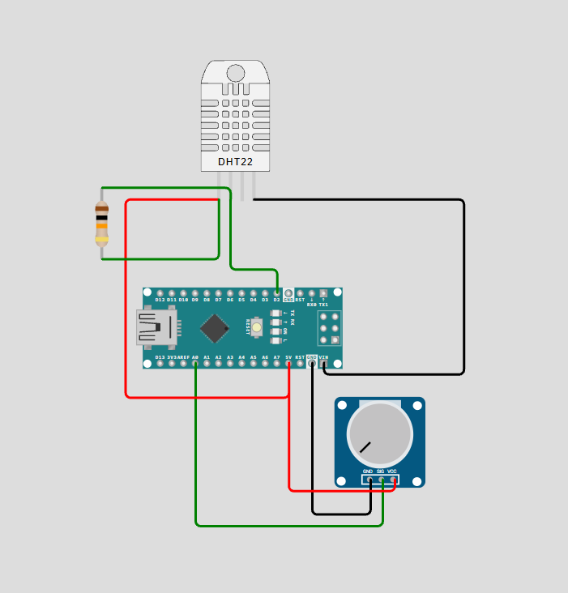

# Arduino sensor system 🌱

Eco-pro uses an Arduino-based sensor setup, simulated in Wokwi.

## Sensors

### DHT22
Measures:
- Temperature
- Relative humidity

The DHT22 data pin is connected to **digital pin 2**.

### Soil-moisture input
In the Wokwi simulation, a potentiometer is used to represent changing soil moisture. It is read through **A0** and converted to a 0–100% relative value.

## Data flow

```text
DHT22 + soil-moisture input
          ↓
       Arduino
          ↓
     Serial output
```

The Arduino prints readings in this format:

```text
temperature,humidity,soil
```

## Wiring diagram

The following diagram shows the Wokwi sensor setup used by Eco-pro.




The Python program is currently tested separately using sensor-style CSV strings. **The live Arduino-to-Python connection has not been implemented yet.**

## Error handling

If the DHT22 does not return a valid temperature or humidity reading, the Arduino prints `ERROR` and waits before trying again.
